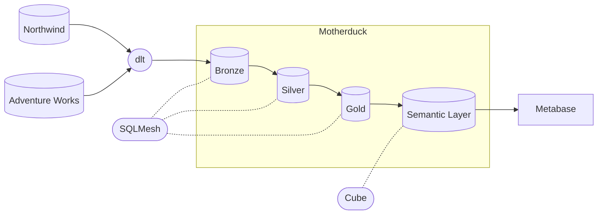
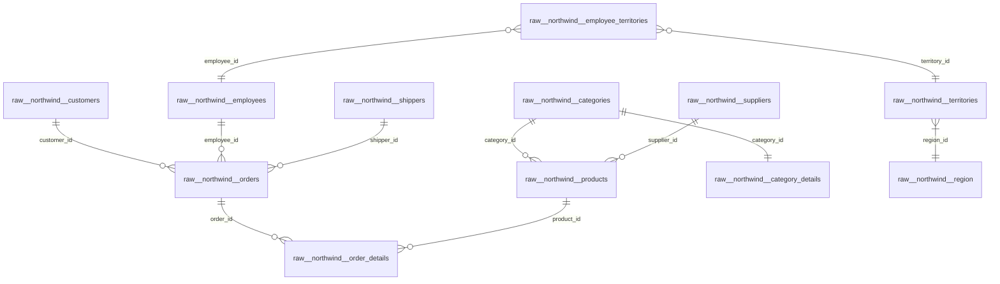
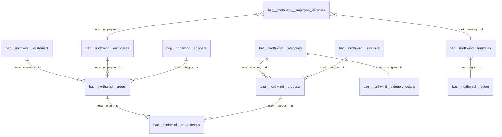
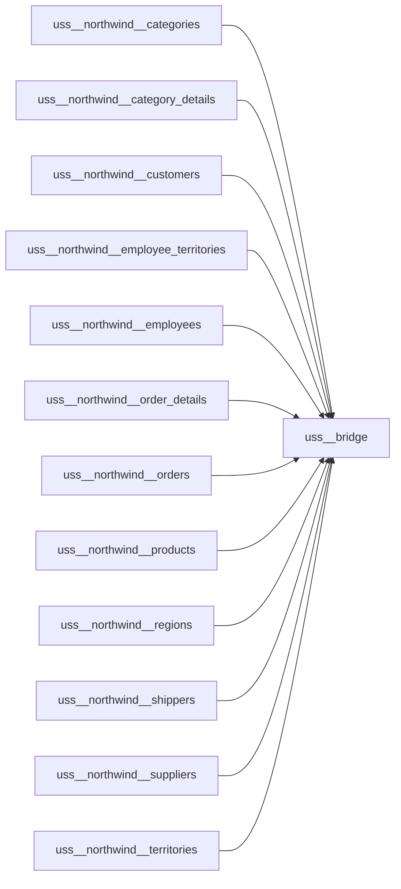

# Obsidian Insights

Personal project for setting up an end-to-end analytics platform.

### Todo:
- [x] Extract & load Northwind from REST API to Mortherduck using dlt.
- [x] Transform using SQLMesh.
- [x] Model the silver layer according to HOOK.
- [x] Model the gold layer as a Unified Star Schema.
- [x] Add GitHub Actions for CI/CD and daily ELT.
- [ ] Create a semantic layer using Cube.
- [ ] Create reports in Metabase.
- [ ] Add Adventure Works to the mix, to train on a scenario with multiple sources.

## Architecture

## ERDs
### bronze.*
#### bronze.raw__northwind__*

### silver.*
#### silver.bag__northwind__*

### gold.*

