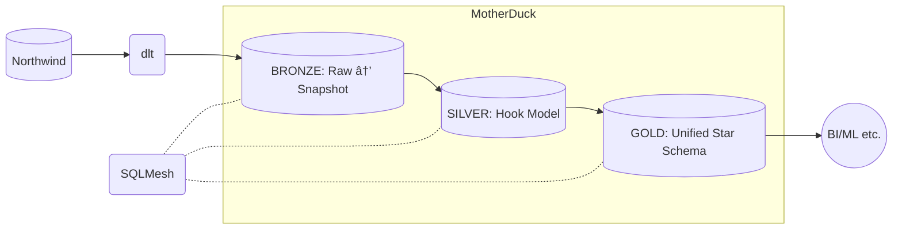

# Obsidian Insights

    
    
    
    

### Goals:
- [x] Extract & load [Northwind](https://demodata.grapecity.com/#NorthWind) via REST API to [MotherDuck](https://www.motherduck.com) using [dlt](https://www.dlthub.com).
- [x] Transform using [SQLMesh](https://www.sqlmesh.com).
- [x] Model the silver layer according to [The Hook Cookbook](https://hookcookbook.substack.com/).
- [x] Model the gold layer as a [Unified Star Schema](https://www.amazon.com/Unified-Star-Schema-Resilient-Warehouse/dp/163462887X).
- [x] Add GitHub Actions for CI/CD and daily ELT.
- [ ] Add Apache Iceberg as an alternative to MotherDuck.

## How To Run
1. Clone the repo.
1. Run `pip install uv`, followed by `uv sync`.
1. Decide if you want to use DuckDB (local) or MotherDuck (remote) as gateway.
    * DuckDB (default)
      1. Add the gateway var in .env: `gateway=duckdb`. (fallback is this)
      1. Add the duckdb_path var in .env: `duckdb_path=your_db.duckdb`. (default is `./obsidian_insights.duckdb`)
    * MotherDuck
      1. Add the gateway var in .env: `gateway=motherduck`. (fallback is `duckdb`)
      1. Create an account on [MotherDuck](https://www.motherduck.com).
        1. Create a database called `obsidian_insights`.
        1. [Create a token](https://motherduck.com/docs/key-tasks/authenticating-and-connecting-to-motherduck/authenticating-to-motherduck/#authentication-using-an-access-token).
        1. Add the motherduck_token var in .env: `motherduck_token=your_token`.
1. Run `init_warehouse.sh` and follow the prompts.
1. Then run `elt.sh` whenever you want to refresh the warehouse.

## Architecture

## Formulas
> **!NOTE**
>
>I'm using this definition of what a measure is:
> 
>>*A measure is a raw quantifiable value representing a specific aspect of performance, status, or characteristics that must include a <ins>**temporal anchor**</ins> specifying the exact point or period in time to which it refers.*
> 
>I.e., a measure <ins>**must**</ins> be associated with a date.
>
>E.g., the amount on an invoice is associated with three dates; incoive date, due date, and payment date.
>That means there will be three measures: amount invoiced, amount due, amount payed.

### Key Performance Indicators
#### Primary
|**Name**|**Temporal Anchor**|**Formula**|
|-|-|-|
|% Order Fill Rate|Order & Ship Date|# Orders Shipped / # Orders Placed|
|% On Time Delivery|Order Due Date|# Orders Shipped On Time / # Orders Due|
|Average Order Processing Time|Shipped Date|Total Order Processing Time / # Orders Shipped|

#### Secondary
|**Name**|**Temporal Anchor**|**Formula**|
|-|-|-|
|Average Age of Open Orders|-|-|
|% Orders Within Capability|-|-|
|Processing Time StDev|-|-|

### Metrics
|**Name**|**Temporal Anchor**|**Formula**|
|-|-|-|
|# Orders Shipped|-|-|
|# Orders Placed|-|-|
|# Orders Shipped On Time|-|-|
|# Orders Due|-|-|
|Total Order Processing Time|-|-|

### Measures
|**Name**|**Temporal Anchor**|**Formula**|
|-|-|-|

### Measures In The Unified Star Schema
Instead of building a regular bridge, we will turn it into an event based bridge.
This will allow us to stack measures in the same graph and on a common date dimension.

This is the normal bridge:
|**Stage**|**_key__orders**|**_key__customers**|
|-|-|-|
|Orders|A|X|
|Orders|B|X|
|Customers|-|X|

We then add the measurements, along with their corresponding date.
- I.e., `# Orders Shipped` would set the date to `shipped_date`.

|**Stage**|**_key__orders**|**_key__customers**|**_key__calendar**|**# Orders Placed**|**# Orders Required**|**# Orders Shipped**|
|-|-|-|-|-|-|-|
|Orders|A|X|2025-01-01|1|-|-|
|Orders|A|X|2025-01-02|-|1|-|
|Orders|A|X|2025-01-02|-|-|1|
|Orders|B|X|2025-01-01|1|-|-|
|Orders|B|X|2025-01-01|-|1|-|
|Orders|B|X|2025-01-01|-|-|1|
|Customers|-|X|-|-|-|-|

What happened is that every row got duplicated, with one line per measurement.
We can do better than this, we can group it by date.

|**Stage**|**_key__orders**|**_key__customers**|**_key__calendar**|**# Orders Placed**|**# Orders Required**|**# Orders Shipped**|
|-|-|-|-|-|-|-|
|Orders|A|X|2025-01-01|1|-|-|
|Orders|A|X|2025-01-02|-|1|1|
|Orders|B|X|2025-01-01|1|1|1|
|Customers|-|X|-|-|-|-|

So, how many orders were placed, required, and shipped per day, for customer X?
|**Customer**|**Date**|**# Orders Placed**|**# Orders Required**|**# Orders Shipped**|
|-|-|-|-|-|
|x|2025-01-01|2|1|1|
|x|2025-01-02|0|1|1|

## Lineage / DAG

## ERDs
### bronze.*
#### bronze.raw__northwind__*

### silver.*

### gold.*

