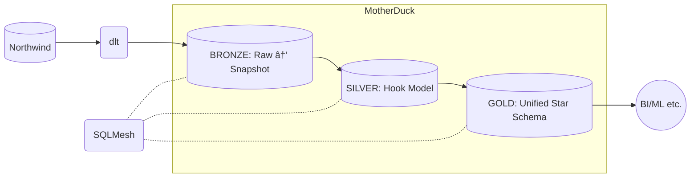

# Obsidian Insights

    
    
    

### Goals:
- [x] Extract & load [Northwind](https://demodata.grapecity.com/#NorthWind) via REST API to [MotherDuck](https://www.motherduck.com) using [dlt](https://www.dlthub.com).
- [x] Transform using [SQLMesh](https://www.sqlmesh.com).
- [x] Model the silver layer according to [The Hook Cookbook](https://hookcookbook.substack.com/).
- [x] Model the gold layer as a [Unified Star Schema](https://www.amazon.com/Unified-Star-Schema-Resilient-Warehouse/dp/163462887X).
- [x] Add GitHub Actions for CI/CD and daily ELT.
- [ ] Add Apache Iceberg as an alternative to MotherDuck.

## How To Run
1. Clone the repo.
2. Run `pip install uv`, followed by `uv sync`.
4. Create an account on [MotherDuck](https://www.motherduck.com).
5. Create a database called `obsidian_insights`.
6. [Create a token](https://motherduck.com/docs/key-tasks/authenticating-and-connecting-to-motherduck/authenticating-to-motherduck/#authentication-using-an-access-token).
7. Save the token (`motherduck_token=your_token`) in an `.env` file, placed at the repo root.
8. Run `init_warehouse.sh`.
9. Then run `elt.sh` whenever you want to refresh the warehouse.

## Architecture

## ERDs
### bronze.*
#### bronze.raw__northwind__*

### silver.*

### gold.*

